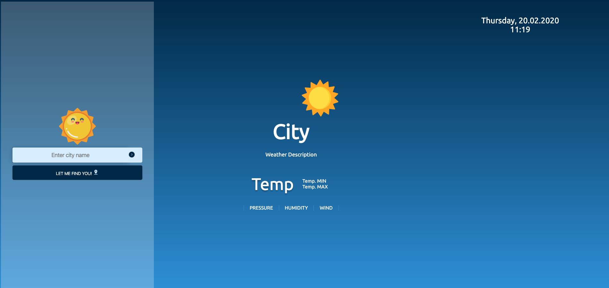
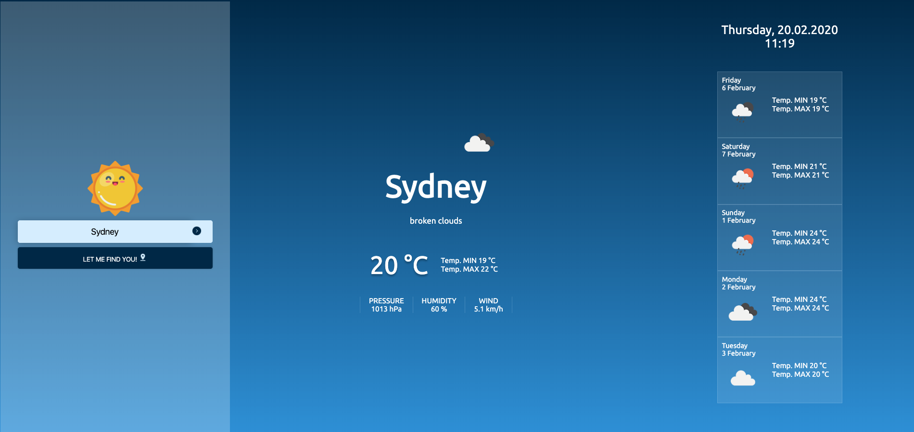

# Weather-app

Web application used for displaying current weather + forecasting 5 days forward in your city of choice.

## Table of contents
* [General info](#general-info)
* [Screenshots](#screenshots)
* [Technologies](#technologies)
* [Setup](#setup)
* [Features](#features)
* [Inspiration](#inspiration)

## General info

The purpose of the project was to learn how to:
* Configure webpack and babel - for backwards compability and module bundling
* Use public API 
* Use JS to access and change elements of an HTML document 

## Screenshots

## Technologies

* `Webpack - v4.41.6`
* `Yarn - v1.19.1` --> https://classic.yarnpkg.com/en/docs/install
* `npm - v6.13.6` --> https://www.npmjs.com/get-npm
* `NodeJS - v13.1.0` --> https://nodejs.org/en/download/
* `JavaScript + HTML5 + SCSS`
* `babel-runtime > core-js@2.6.11`

## Setup

1. `git clone https://github.com/KalitaKonrad/Weather-app.git`
2. `cd weather-app`
3. `yarn install`
4. `yarn start:dev` --> default port: `localhost:8080` on your browser

## Features

Displaying and forecasting weather by:
* City name
* User's location 

## Inspiration

Project made for CodersCamp -- Web Development Course.
